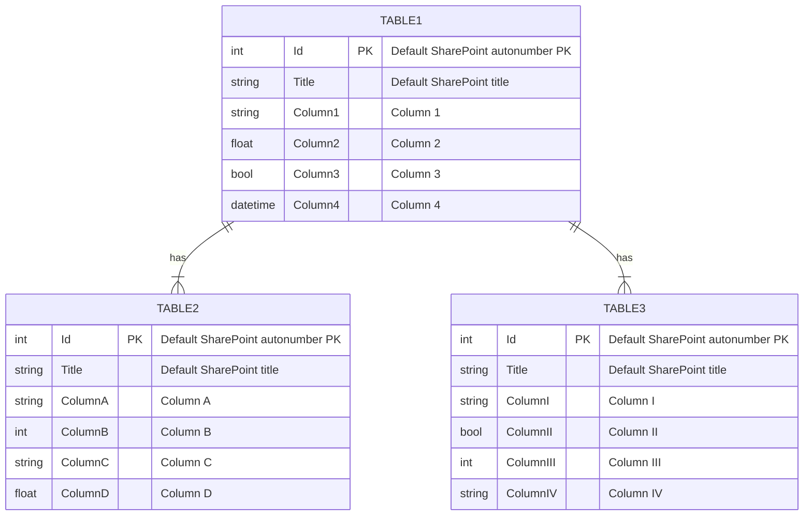

# Stack 2.0 App
This is a template repository for a Stack 2.0 app. Rename the title above to your project name.

## Introduction
Introduce your project here. Guiding questions:

1. Who are your end users?
2. What is the current business problem?
3. What is your solution (in a nutshell)?
4. What is the value proposition for your solution?

## Data
1. Briefly outline the data for the app.
2. Map out the Entity-Relationship Diagram (ERD). A sample is provided below:

