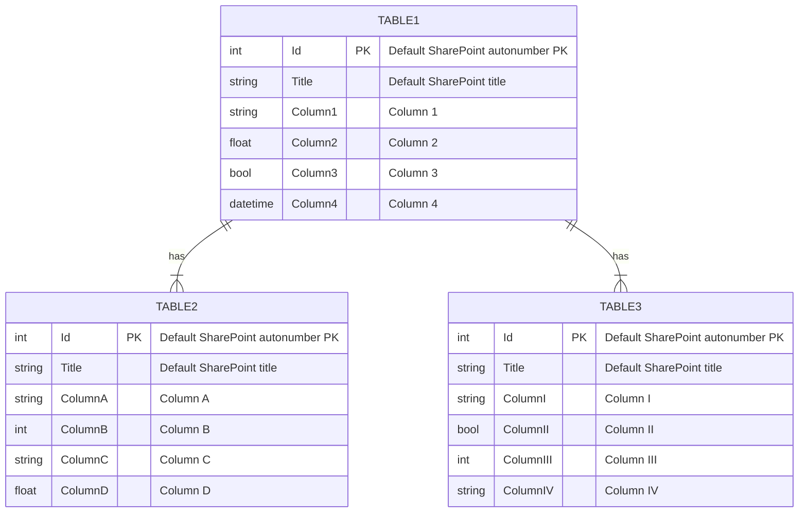

# Stack 2.0 App
This is a template repository for a Stack 2.0 app. Rename the title above to your project name.

## Introduction
Introduce your project here. Guiding questions:

1. Who are your end users?
2. What is the current business problem?
3. What is your solution (in a nutshell)?
4. What is the value proposition for your solution?

## Data
1. Briefly outline the data for the app.
2. Map out the Entity-Relationship Diagram (ERD). A sample is provided below:

## Security
Develop with security in mind. Refer to the following resources by the Open Web Application Security Project's (OWASP) resources:

1. Coding Practices: [Secure Coding Practices Guide and Checklist](https://owasp.org/www-pdf-archive/OWASP_SCP_Quick_Reference_Guide_v2.pdf)
2. Testing: [Web Security Testing Guide](https://github.com/OWASP/wstg/)
3. Standards: [Application Security Verification Standard (ASVS)](https://github.com/OWASP/ASVS)

Tools to incorporate (WIP):

1. Snyk.io
2. Jest

### OWASP Secure Coding Practices Checklist

1. Input Validation

Check out this [cheatsheet by OWASP](https://cheatsheetseries.owasp.org/cheatsheets/Input_Validation_Cheat_Sheet.html) for implementation details.

- [ ] Conduct all data validation on a trusted system (e.g. the server).
- [ ] Identify all data sources and classify them into trusted and untrusted. Validate all data from untrusted sources (e.g. Databases, file streams).
- [ ] There should be a centralized input validation routine for the application.
- [ ] Specify proper character sets, such as UTF-8, for all sources of input.
- [ ] Encode data to a common character set before validating (Canonicalize).
- [ ] All validation failures should result in input rejection.
- [ ] Determine if the system supports UTF-8 extended character sets and if so, validate after UTF-8 decoding is completed.
- [ ] Validate all client provided data before processing, including all parameters, URLs and HTTP header content (e.g. Cookie names and values). Be sure to include automated post backs from JavaScript, Flash or other embedded code.
- [ ] Verify that header values in both requests and responses contain only ASCII characters.
- [ ] Validate data from redirects (An attacker may submit malicious content directly to the target of the redirect, thus circumventing application logic and any validation performed before the redirect).
- [ ] Validate for expected data types.
- [ ] Validate data range.
- [ ] Validate data length.
- [ ] Validate all input against a "whitelist" of allowed characters, whenever possible.
- [ ] If any potentially hazardous characters must be allowed as input, be sure that you implement additional controls like output encoding, secure task specific APIs and accounting for the utilization of that data throughout the application . Examples of common hazardous characters include: < > " ' % ( ) & + \ \' \" .
- [ ] If your standard validation routine cannot address the following inputs, then they should be checked discretely. Check for (1) null bytes (%00), (2) new line characters (%0d, %0a, \r, \n), and (3) "dot-dot-slahs" path alterations characters.

2. Output Encoding

- [ ] Conduct all encoding on a trusted system (e.g. the server).
- [ ] Utilize a standard, tested routine for each type of outbound encoding.
- [ ] Contextually output encode all data returned to the client that originated outside the application's trust boundary. HTML entity encoding is one example, but does not work in all cases.
- [ ] Encode all characters unless they are known to be safe for the intended interpreter.
- [ ] Contextually sanitize all output of un-trusted data to queries for SQL, XML, and LDAP.
- [ ] Sanitize all output of un-trusted data to operating system commands.

3. Authentication and Password Management

- [ ] Require authentication for all pages and resources, except those specifically intended to be public.
- [ ] All authentication controls must be enforced on a trusted system (e.g. the server).
- [ ] Establish and utilize standard, tested, authentication services whenever possible.
- [ ] Use a centralized implementation for all authentication controls, including libraries that call external authentication services.
- [ ] Segregate authentication logic from the resource being requested and use redirection to and from the centralized authentication control.
- [ ] All authentication controls should fail securely.
- [ ] All administrative and account management functions must be at least as secure as the primary authentication mechanism.
- [ ] If your application manages a credential store, it should ensure that only cryptographically strong oneway salted hashes of passwords are stored and that the table/file that stores the passwords and keys is write-able only by the application. (Do not use the MD5 algorithm if it can be avoided).
- [ ] Password hashing must be implemented on a trusted system (e.g. the server).
- [ ] Validate the authentication data only on completion of all data input, especially for sequential authentication implementations.
- [ ] Authentication failure responses should not indicate which part of the authentication data was incorrect. For example, instead of "Invalid username" or "Invalid password", just use "Invalid username and/or password" for both. Error responses must be truly identical in both display and source code.
- [ ] Utilize authentication for connections to external systems that involve sensitive information or functions.
- [ ] Authentication credentials for accessing services external to the application should be encrypted and stored in a protected location on a trusted system (e.g. the server). The source code is NOT a secure location.
- [ ] Use only HTTP POST requests to transmit authentication credentials.
- [ ] Only send non-temporary passwords over an encrypted connection or as encrypted data, such as in an encrypted email. Temporary passwords associated with email resets may be an exception.
- [ ] Enforce password complexity requirements established by policy or regulation. Authentication credentials should be sufficient to withstand attacks that are typical of the threats in the deployed environment. (e.g., requiring the use of alphabetic as well as numeric and/or special characters).
- [ ] Enforce password length requirements established by policy or regulation. Eight characters is commonly used, but 16 is better or consider the use of multi-word pass phrases.
- [ ] Password entry should be obscured on the user's screen. (e.g., on web forms use the input type "password").
- [ ] Enforce account disabling after an established number of invalid login attempts (e.g., five attempts is common). The account must be disabled for a period of time sufficient to discourage brute force guessing of credentials, but not so long as to allow for a denial-of-service attack to be performed.
- [ ] Password reset and changing operations require the same level of controls as account creation and authentication.
- [ ] Password reset questions should support sufficiently random answers. (e.g., "favorite book" is a bad question because “The Bible” is a very common answer).
- [ ] If using email based resets, only send email to a pre-registered address with a temporary link/password.
- [ ] Temporary passwords and links should have a short expiration time.
- [ ] Enforce the changing of temporary passwords on the next use.
- [ ] Notify users when a password reset occurs.
- [ ] Prevent password re-use.
- [ ] Passwords should be at least one day old before they can be changed, to prevent attacks on password re-use.
- [ ] Enforce password changes based on requirements established in policy or regulation. Critical systems may require more frequent changes. The time between resets must be administratively controlled.
- [ ] Disable "remember me" functionality for password fields.
- [ ] The last use (successful or unsuccessful) of a user account should be reported to the user at their next successful login.
- [ ] Implement monitoring to identify attacks against multiple user accounts, utilizing the same password. This attack pattern is used to bypass standard lockouts, when user IDs can be harvested or guessed.
- [ ] Change all vendor-supplied default passwords and user IDs or disable the associated accounts.
- [ ] Re-authenticate users prior to performing critical operations.
- [ ] Use Multi-Factor Authentication for highly sensitive or high value transactional accounts.
- [ ] If using third party code for authentication, inspect the code carefully to ensure it is not affected by any malicious code.

4. Session Management

- [ ] Use the server or framework’s session management controls. The application should only recognize these session identifiers as valid.
- [ ] Session identifier creation must always be done on a trusted system (e.g. the server).
- [ ] Session management controls should use well vetted algorithms that ensure sufficiently random session identifiers.
- [ ] Set the domain and path for cookies containing authenticated session identifiers to an appropriately restricted value for the site.
- [ ] Logout functionality should fully terminate the associated session or connection.
- [ ] Logout functionality should be available from all pages protected by authorization.
- [ ] Establish a session inactivity timeout that is as short as possible, based on balancing risk and business functional requirements. In most cases it should be no more than several hours.
- [ ] Disallow persistent logins and enforce periodic session terminations, even when the session is active. Especially for applications supporting rich network connections or connecting to critical systems. Termination times should support business requirements and the user should receive sufficient notification to mitigate negative impacts.
- [ ] If a session was established before login, close that session and establish a new session after a successful login.
- [ ] Generate a new session identifier on any re-authentication.
- [ ] Do not allow concurrent logins with the same user ID.
- [ ] Do not expose session identifiers in URLs, error messages or logs. Session identifiers should only be located in the HTTP cookie header. For example, do not pass session identifiers as GET parameters.
- [ ] Protect server side session data from unauthorized access, by other users of the server, by implementing appropriate access controls on the server.
- [ ] Generate a new session identifier and deactivate the old one periodically. (This can mitigate certain session hijacking scenarios where the original identifier was compromised)
- [ ] Generate a new session identifier if the connection security changes from HTTP to HTTPS, as can occur during authentication. Within an application, it is recommended to consistently utilize HTTPS rather than switching between HTTP to HTTPS.
- [ ] Supplement standard session management for sensitive server-side operations, like account management, by utilizing per-session strong random tokens or parameters. This method can be used to prevent Cross Site Request Forgery attacks.
- [ ] Supplement standard session management for highly sensitive or critical operations by utilizing perrequest, as opposed to per-session, strong random tokens or parameters.
- [ ] Set the "secure" attribute for cookies transmitted over an TLS connection.
- [ ] Set cookies with the HttpOnly attribute, unless you specifically require client-side scripts within your application to read or set a cookie's value.

5. Access Control

- [ ] Use only trusted system objects, e.g. server side session objects, for making access authorization decisions.
- [ ] Use a single site-wide component to check access authorization. This includes libraries that call external authorization services.
- [ ] Access controls should fail securely.
- [ ] Deny all access if the application cannot access its security configuration information.
- [ ] Enforce authorization controls on every request, including those made by server side scripts, "includes" and requests from rich client-side technologies like AJAX and Flash.
- [ ] Segregate privileged logic from other application code.
- [ ] Restrict access to files or other resources, including those outside the application's direct control, to only authorized users.
- [ ] Restrict access to protected URLs to only authorized users.
- [ ] Restrict access to protected functions to only authorized users.
- [ ] Restrict direct object references to only authorized users.
- [ ] Restrict access to services to only authorized users.
- [ ] Restrict access to application data to only authorized users.
- [ ] Restrict access to user and data attributes and policy information used by access controls.
- [ ] Restrict access security-relevant configuration information to only authorized users.
- [ ] Server side implementation and presentation layer representations of access control rules must match.
- [ ] If state data must be stored on the client, use encryption and integrity checking on the server side to catch state tampering.
- [ ] Enforce application logic flows to comply with business rules.
- [ ] Limit the number of transactions a single user or device can perform in a given period of time. The transactions/time should be above the actual business requirement, but low enough to deter automated attacks.
- [ ] Use the "referer" header as a supplemental check only, it should never be the sole authorization check, as it is can be spoofed.
- [ ] If long authenticated sessions are allowed, periodically re-validate a user’s authorization to ensure that their privileges have not changed and if they have, log the user out and force them to re-authenticate.
- [ ] Implement account auditing and enforce the disabling of unused accounts (e.g., After no more than 30 days from the expiration of an account’s password.).
- [ ] The application must support disabling of accounts and terminating sessions when authorization ceases (e.g., Changes to role, employment status, business process, etc.).
- [ ] Service accounts or accounts supporting connections to or from external systems should have the least privilege possible.
- [ ] Create an Access Control Policy to document an application's business rules, data types and access authorization criteria and/or processes so that access can be properly provisioned and controlled. This includes identifying access requirements for both the data and system resources.

6. Cryptographic Practices

- [ ] All cryptographic functions used to protect secrets from the application user must be implemented on a trusted system (e.g. the server).
- [ ] Protect master secrets from unauthorized access.
- [ ] Cryptographic modules should fail securely.
- [ ] All random numbers, random file names, random GUIDs, and random strings should be generated using the cryptographic module’s approved random number generator when these random values are intended to be un-guessable.
- [ ] Cryptographic modules used by the application should be compliant to FIPS 140-2 or an equivalent standard.
- [ ] Establish and utilize a policy and process for how cryptographic keys will be managed.

7. Error Handling and Logging

- [ ] Do not disclose sensitive information in error responses, including system details, session identifiers or account information.
- [ ] Use error handlers that do not display debugging or stack trace information.
- [ ] Implement generic error messages and use custom error pages.
- [ ] The application should handle application errors and not rely on the server configuration.
- [ ] Properly free allocated memory when error conditions occur.
- [ ] Error handling logic associated with security controls should deny access by default.
- [ ] All logging controls should be implemented on a trusted system (e.g. the server).
- [ ] Logging controls should support both success and failure of specified security events.
- [ ] Ensure logs contain important log event data.
- [ ] Ensure log entries that include un-trusted data will not execute as code in the intended log viewing interface or software.
- [ ] Restrict access to logs to only authorized individuals.
- [ ] Utilize a master routine for all logging operations.
- [ ] Do not store sensitive information in logs, including unnecessary system details, session identifiers or passwords.
- [ ] Ensure that a mechanism exists to conduct log analysis.
- [ ] Log all input validation failures.
- [ ] Log all authentication attempts, especially failures.
- [ ] Log all access control failures.
- [ ] Log all apparent tampering events, including unexpected changes to state data.
- [ ] Log attempts to connect with invalid or expired session tokens.
- [ ] Log all system exceptions.
- [ ] Log all administrative functions, including changes to the security configuration settings.
- [ ] Log all backend TLS connection failures.
- [ ] Log cryptographic module failures.
- [ ] Use a cryptographic hash function to validate log entry integrity.

8. Data Protection

- [ ] Implement least privilege, restrict users to only the functionality, data and system information that is required to perform their tasks.
- [ ] Protect all cached or temporary copies of sensitive data stored on the server from unauthorized access and purge those temporary working files a soon as they are no longer required.
- [ ] Encrypt highly sensitive stored information, like authentication verification data, even on the server side. Always use well vetted algorithms, see "Cryptographic Practices" for additional guidance.
- [ ] Protect server-side source-code from being downloaded by a user.
- [ ] Do not store passwords, connection strings or other sensitive information in clear text or in any noncryptographically secure manner on the client side. This includes embedding in insecure formats like: MS viewstate, Adobe flash or compiled code.
- [ ] Remove comments in user accessible production code that may reveal backend system or other sensitive information.
- [ ] Remove unnecessary application and system documentation as this can reveal useful information to attackers.
- [ ] Do not include sensitive information in HTTP GET request parameters.
- [ ] Disable auto complete features on forms expected to contain sensitive information, including authentication.
- [ ] Disable client side caching on pages containing sensitive information. Cache-Control: no-store, may be used in conjunction with the HTTP header control "Pragma: no-cache", which is less effective, but is HTTP/1.0 backward compatible.
- [ ] The application should support the removal of sensitive data when that data is no longer required. (e.g. personal information or certain financial data).
- [ ] Implement appropriate access controls for sensitive data stored on the server. This includes cached data, temporary files and data that should be accessible only by specific system users.

9. Communication Security

- [ ] Implement encryption for the transmission of all sensitive information. This should include TLS for protecting the connection and may be supplemented by discrete encryption of sensitive files or non-HTTP based connections.
- [ ] TLS certificates should be valid and have the correct domain name, not be expired, and be installed with intermediate certificates when required.
- [ ] Failed TLS connections should not fall back to an insecure connection.
- [ ] Utilize TLS connections for all content requiring authenticated access and for all other sensitive information.
- [ ] Utilize TLS for connections to external systems that involve sensitive information or functions.
- [ ] Utilize a single standard TLS implementation that is configured appropriately.
- [ ] Specify character encodings for all connections.
- [ ] Filter parameters containing sensitive information from the HTTP referer, when linking to external sites.

10. System Configuration

- [ ] Ensure servers, frameworks and system components are running the latest approved version.
- [ ] Ensure servers, frameworks and system components have all patches issued for the version in use.
- [ ] Turn off directory listings.
- [ ] Restrict the web server, process and service accounts to the least privileges possible.
- [ ] When exceptions occur, fail securely.
- [ ] Remove all unnecessary functionality and files.
- [ ] Remove test code or any functionality not intended for production, prior to deployment.
- [ ] Prevent disclosure of your directory structure in the robots.txt file by placing directories not intended for public indexing into an isolated parent directory. Then "Disallow" that entire parent directory in the robots.txt file rather than Disallowing each individual directory.
- [ ] Define which HTTP methods, Get or Post, the application will support and whether it will be handled differently in different pages in the application.
- [ ] Disable unnecessary HTTP methods, such as WebDAV extensions. If an extended HTTP method that supports file handling is required, utilize a well-vetted authentication mechanism.
- [ ] If the web server handles both HTTP 1.0 and 1.1, ensure that both are configured in a similar manor or insure that you understand any difference that may exist (e.g. handling of extended HTTP methods).
- [ ] Remove unnecessary information from HTTP response headers related to the OS, web-server version and application frameworks.
- [ ] The security configuration store for the application should be able to be output in human readable form to support auditing.
- [ ] Implement an asset management system and register system components and software in it.
- [ ] Isolate development environments from the production network and provide access only to authorized development and test groups. Development environments are often configured less securely than production environments and attackers may use this difference to discover shared weaknesses or as an avenue for exploitation.
- [ ] Implement a software change control system to manage and record changes to the code both in development and production.

11. Database Security

- [ ] Use strongly typed parameterized queries.
- [ ] Utilize input validation and output encoding and be sure to address meta characters. If these fail, do not run the database command.
- [ ] Ensure that variables are strongly typed.
- [ ] The application should use the lowest possible level of privilege when accessing the database.
- [ ] Use secure credentials for database access.
- [ ] Connection strings should not be hard coded within the application. Connection strings should be stored in a separate configuration file on a trusted system and they should be encrypted.
- [ ] Use stored procedures to abstract data access and allow for the removal of permissions to the base tables in the database.
- [ ] Close the connection as soon as possible.
- [ ] Remove or change all default database administrative passwords. Utilize strong passwords/phrases or implement multi-factor authentication.
- [ ] Turn off all unnecessary database functionality (e.g., unnecessary stored procedures or services, utility packages, install only the minimum set of features and options required (surface area reduction)).
- [ ] Remove unnecessary default vendor content (e.g., sample schemas).
- [ ] Disable any default accounts that are not required to support business requirements.
- [ ] The application should connect to the database with different credentials for every trust distinction (e.g., user, read-only user, guest, administrators).

12. File Management

- [ ] Do not pass user supplied data directly to any dynamic include function.
- [ ] Require authentication before allowing a file to be uploaded.
- [ ] Limit the type of files that can be uploaded to only those types that are needed for business purposes.
- [ ] Validate uploaded files are the expected type by checking file headers. Checking for file type by extension alone is not sufficient.
- [ ] Do not save files in the same web context as the application. Files should either go to the content server or in the database.
- [ ] Prevent or restrict the uploading of any file that may be interpreted by the web server.
- [ ] Turn off execution privileges on file upload directories.
- [ ] Implement safe uploading in UNIX by mounting the targeted file directory as a logical drive using the associated path or the chrooted environment.
- [ ] When referencing existing files, use a white list of allowed file names and types. Validate the value of the parameter being passed and if it does not match one of the expected values, either reject it or use a hard coded default file value for the content instead.
- [ ] Do not pass user supplied data into a dynamic redirect. If this must be allowed, then the redirect should accept only validated, relative path URLs.
- [ ] Do not pass directory or file paths, use index values mapped to pre-defined list of paths Never send the absolute file path to the client.
- [ ] Ensure application files and resources are read-only.
- [ ] Scan user uploaded files for viruses and malware.

13. Memory Management

- [ ] Utilize input and output control for un-trusted data.
- [ ] Double check that the buffer is as large as specified.
- [ ] When using functions that accept a number of bytes to copy, such as strncpy(), be aware that if the destination buffer size is equal to the source buffer size, it may not NULL-terminate the string.
- [ ] Check buffer boundaries if calling the function in a loop and make sure there is no danger of writing past the allocated space.
- [ ] Truncate all input strings to a reasonable length before passing them to the copy and concatenation functions.
- [ ] Specifically close resources, don’t rely on garbage collection. (e.g., connection objects, file handles, etc.).
- [ ] Use non-executable stacks when available.
- [ ] Avoid the use of known vulnerable functions (e.g., printf, strcat, strcpy etc.).
- [ ] Properly free allocated memory upon the completion of functions and at all exit points.

14. General Coding Practices

- [ ] Use tested and approved managed code rather than creating new unmanaged code for common tasks.
- [ ] Utilize task specific built-in APIs to conduct operating system tasks. Do not allow the application to issue commands directly to the Operating System, especially through the use of application initiated command shells.
- [ ] Use checksums or hashes to verify the integrity of interpreted code, libraries, executables, and configuration files.
- [ ] Utilize locking to prevent multiple simultaneous requests or use a synchronization mechanism to prevent race conditions.
- [ ] Protect shared variables and resources from inappropriate concurrent access.
- [ ] Explicitly initialize all your variables and other data stores, either during declaration or just before the first usage.
- [ ] In cases where the application must run with elevated privileges, raise privileges as late as possible, and drop them as soon as possible.
- [ ] Avoid calculation errors by understanding your programming language's underlying representation and how it interacts with numeric calculation. Pay close attention to byte size discrepancies, precision, signed/unsigned distinctions, truncation, conversion and casting between types, "not-a-number" calculations, and how your language handles numbers that are too large or too small for its underlying representation.
- [ ] Do not pass user supplied data to any dynamic execution function.
- [ ] Restrict users from generating new code or altering existing code.
- [ ] Review all secondary applications, third party code and libraries to determine business necessity and validate safe functionality, as these can introduce new vulnerabilities.
- [ ] Implement safe updating. If the application will utilize automatic updates, then use cryptographic signatures for your code and ensure your download clients verify those signatures. Use encrypted channels to transfer the code from the host server.

### React Bad Practices
Avoid the following:

- Creating React components from user-supplied objects;
- Rendering links with user-supplied href attributes, or other HTML tags with injectable attributes (link tag, HMTL5 imports)
- Explicitly setting the dangerouslySetInnerHTML prop of an element
- Passing user-supplied strings to eval()

### OWASP Web Security Testing Guide Checklist
The `Status` column can be set for values similar to "Pass", "Fail", "N/A".

1. Information Gathering

- [ ] [Conduct Search Engine Discovery Reconnaissance for Information Leakage](https://github.com/OWASP/wstg/blob/master/document/4-Web_Application_Security_Testing/01-Information_Gathering/01-Conduct_Search_Engine_Discovery_Reconnaissance_for_Information_Leakage.md)
- [ ] [Fingerprint Web Server](https://github.com/OWASP/wstg/blob/master/document/4-Web_Application_Security_Testing/01-Information_Gathering/02-Fingerprint_Web_Server.md)
- [ ] [Review Webserver Metafiles for Information Leakage](https://github.com/OWASP/wstg/blob/master/document/4-Web_Application_Security_Testing/01-Information_Gathering/03-Review_Webserver_Metafiles_for_Information_Leakage.md)
- [ ] [Enumerate Applications on Webserver](https://github.com/OWASP/wstg/blob/master/document/4-Web_Application_Security_Testing/01-Information_Gathering/04-Enumerate_Applications_on_Webserver.md)
- [ ] [Review Webpage Content for Information Leakage](https://github.com/OWASP/wstg/blob/master/document/4-Web_Application_Security_Testing/01-Information_Gathering/05-Review_Webpage_Content_for_Information_Leakage.md)
- [ ] [Identify application entry points](https://github.com/OWASP/wstg/blob/master/document/4-Web_Application_Security_Testing/01-Information_Gathering/06-Identify_Application_Entry_Points.md)
- [ ] [Map execution paths through application](https://github.com/OWASP/wstg/blob/master/document/4-Web_Application_Security_Testing/01-Information_Gathering/07-Map_Execution_Paths_Through_Application.md)
- [ ] [Fingerprint Web Application Framework](https://github.com/OWASP/wstg/blob/master/document/4-Web_Application_Security_Testing/01-Information_Gathering/08-Fingerprint_Web_Application_Framework.md)
- [X] ~~Fingerprint Web Application~~
- [ ] [Map Application Architecture](https://github.com/OWASP/wstg/blob/master/document/4-Web_Application_Security_Testing/01-Information_Gathering/10-Map_Application_Architecture.md)

2. Configuration and Deploy Management Testing

- [ ] [Test Network Infrastructure Configuration](https://github.com/OWASP/wstg/blob/master/document/4-Web_Application_Security_Testing/02-Configuration_and_Deployment_Management_Testing/01-Test_Network_Infrastructure_Configuration.md)
- [ ] [Test Application Platform Configuration](https://github.com/OWASP/wstg/blob/master/document/4-Web_Application_Security_Testing/02-Configuration_and_Deployment_Management_Testing/02-Test_Application_Platform_Configuration.md)
- [ ] [Test File Extensions Handling for Sensitive Information](https://github.com/OWASP/wstg/blob/master/document/4-Web_Application_Security_Testing/02-Configuration_and_Deployment_Management_Testing/03-Test_File_Extensions_Handling_for_Sensitive_Information.md)
- [ ] [Review Old Backup and Unreferenced Files for Sensitive Information](https://github.com/OWASP/wstg/blob/master/document/4-Web_Application_Security_Testing/02-Configuration_and_Deployment_Management_Testing/04-Review_Old_Backup_and_Unreferenced_Files_for_Sensitive_Information.md)
- [ ] [Enumerate Infrastructure and Application Admin Interfaces](https://github.com/OWASP/wstg/blob/master/document/4-Web_Application_Security_Testing/02-Configuration_and_Deployment_Management_Testing/05-Enumerate_Infrastructure_and_Application_Admin_Interfaces.md)
- [ ] [Test HTTP Methods](https://github.com/OWASP/wstg/blob/master/document/4-Web_Application_Security_Testing/02-Configuration_and_Deployment_Management_Testing/06-Test_HTTP_Methods.md)
- [ ] [Test HTTP Strict Transport Security](https://github.com/OWASP/wstg/blob/master/document/4-Web_Application_Security_Testing/02-Configuration_and_Deployment_Management_Testing/07-Test_HTTP_Strict_Transport_Security.md)
- [ ] [Test RIA cross domain policy](https://github.com/OWASP/wstg/blob/master/document/4-Web_Application_Security_Testing/02-Configuration_and_Deployment_Management_Testing/08-Test_RIA_Cross_Domain_Policy.md)
- [ ] [Test File Permission](https://github.com/OWASP/wstg/blob/master/document/4-Web_Application_Security_Testing/02-Configuration_and_Deployment_Management_Testing/09-Test_File_Permission.md)
- [ ] [Test for Subdomain Takeover](https://github.com/OWASP/wstg/blob/master/document/4-Web_Application_Security_Testing/02-Configuration_and_Deployment_Management_Testing/10-Test_for_Subdomain_Takeover.md)
- [ ] [Test Cloud Storage](https://github.com/OWASP/wstg/blob/master/document/4-Web_Application_Security_Testing/02-Configuration_and_Deployment_Management_Testing/11-Test_Cloud_Storage.md)

3. Identity Management Testing

- [ ] [Test Role Definitions](https://github.com/OWASP/wstg/blob/master/document/4-Web_Application_Security_Testing/03-Identity_Management_Testing/01-Test_Role_Definitions.md)
- [ ] [Test User Registration Process](https://github.com/OWASP/wstg/blob/master/document/4-Web_Application_Security_Testing/03-Identity_Management_Testing/02-Test_User_Registration_Process.md)
- [ ] [Test Account Provisioning Process](https://github.com/OWASP/wstg/blob/master/document/4-Web_Application_Security_Testing/03-Identity_Management_Testing/03-Test_Account_Provisioning_Process.md)
- [ ] [Testing for Account Enumeration and Guessable User Account](https://github.com/OWASP/wstg/blob/master/document/4-Web_Application_Security_Testing/03-Identity_Management_Testing/04-Testing_for_Account_Enumeration_and_Guessable_User_Account.md)
- [ ] [Testing for Weak or unenforced username policy](https://github.com/OWASP/wstg/blob/master/document/4-Web_Application_Security_Testing/03-Identity_Management_Testing/05-Testing_for_Weak_or_Unenforced_Username_Policy.md)

4. Authentication Testing

- [ ] [Testing for Credentials Transported over an Encrypted Channel](https://github.com/OWASP/wstg/blob/master/document/4-Web_Application_Security_Testing/04-Authentication_Testing/01-Testing_for_Credentials_Transported_over_an_Encrypted_Channel.md)
- [ ] [Testing for Default Credentials](https://github.com/OWASP/wstg/blob/master/document/4-Web_Application_Security_Testing/04-Authentication_Testing/02-Testing_for_Default_Credentials.md)
- [ ] [Testing for Weak Lock Out Mechanism](https://github.com/OWASP/wstg/blob/master/document/4-Web_Application_Security_Testing/04-Authentication_Testing/03-Testing_for_Weak_Lock_Out_Mechanism.md)
- [ ] [Testing for Bypassing Authentication Schema](https://github.com/OWASP/wstg/blob/master/document/4-Web_Application_Security_Testing/04-Authentication_Testing/04-Testing_for_Bypassing_Authentication_Schema.md)
- [ ] [Testing for Vulnerable Remember Password](https://github.com/OWASP/wstg/blob/master/document/4-Web_Application_Security_Testing/04-Authentication_Testing/05-Testing_for_Vulnerable_Remember_Password.md)
- [ ] [Testing for Browser Cache Weaknesses](https://github.com/OWASP/wstg/blob/master/document/4-Web_Application_Security_Testing/04-Authentication_Testing/06-Testing_for_Browser_Cache_Weaknesses.md)
- [ ] [Testing for Weak Password Policy](https://github.com/OWASP/wstg/blob/master/document/4-Web_Application_Security_Testing/04-Authentication_Testing/07-Testing_for_Weak_Password_Policy.md)
- [ ] [Testing for Weak Security Question Answer](https://github.com/OWASP/wstg/blob/master/document/4-Web_Application_Security_Testing/04-Authentication_Testing/08-Testing_for_Weak_Security_Question_Answer.md)
- [ ] [Testing for Weak Password Change or Reset Functionalities](https://github.com/OWASP/wstg/blob/master/document/4-Web_Application_Security_Testing/04-Authentication_Testing/09-Testing_for_Weak_Password_Change_or_Reset_Functionalities.md)
- [ ] [Testing for Weaker Authentication in Alternative Channel](https://github.com/OWASP/wstg/blob/master/document/4-Web_Application_Security_Testing/04-Authentication_Testing/10-Testing_for_Weaker_Authentication_in_Alternative_Channel.md)

5. Authorisation Testing

- [ ] [Testing Directory Traversal File Include](https://github.com/OWASP/wstg/blob/master/document/4-Web_Application_Security_Testing/05-Authorization_Testing/01-Testing_Directory_Traversal_File_Include.md)
- [ ] [Testing for Bypassing Authorization Schema](https://github.com/OWASP/wstg/blob/master/document/4-Web_Application_Security_Testing/05-Authorization_Testing/02-Testing_for_Bypassing_Authorization_Schema.md)
- [ ] [Testing for Privilege Escalation](https://github.com/OWASP/wstg/blob/master/document/4-Web_Application_Security_Testing/05-Authorization_Testing/03-Testing_for_Privilege_Escalation.md)
- [ ] [Testing for Insecure Direct Object References](https://github.com/OWASP/wstg/blob/master/document/4-Web_Application_Security_Testing/05-Authorization_Testing/05-Testing_for_OAuth_Weaknesses.md)

6. Session Management Testing

- [ ] [Testing for Session Management Schema](https://github.com/OWASP/wstg/blob/master/document/4-Web_Application_Security_Testing/06-Session_Management_Testing/01-Testing_for_Session_Management_Schema.md)
- [ ] [Testing for Cookies Attributes](https://github.com/OWASP/wstg/blob/master/document/4-Web_Application_Security_Testing/06-Session_Management_Testing/02-Testing_for_Cookies_Attributes.md)
- [ ] [Testing for Session Fixation](https://github.com/OWASP/wstg/blob/master/document/4-Web_Application_Security_Testing/06-Session_Management_Testing/03-Testing_for_Session_Fixation.md)
- [ ] [Testing for Exposed Session Variables](https://github.com/OWASP/wstg/blob/master/document/4-Web_Application_Security_Testing/06-Session_Management_Testing/04-Testing_for_Exposed_Session_Variables.md)
- [ ] [Testing for Cross Site Request Forgery](https://github.com/OWASP/wstg/blob/master/document/4-Web_Application_Security_Testing/06-Session_Management_Testing/05-Testing_for_Cross_Site_Request_Forgery.md)
- [ ] [Testing for Logout Functionality](https://github.com/OWASP/wstg/blob/master/document/4-Web_Application_Security_Testing/06-Session_Management_Testing/06-Testing_for_Logout_Functionality.md)
- [ ] [Testing Session Timeout](https://github.com/OWASP/wstg/blob/master/document/4-Web_Application_Security_Testing/06-Session_Management_Testing/07-Testing_Session_Timeout.md)
- [ ] [Testing for Session Puzzling](https://github.com/OWASP/wstg/blob/master/document/4-Web_Application_Security_Testing/06-Session_Management_Testing/08-Testing_for_Session_Puzzling.md)
- [ ] [Testing for Session Hijacking](https://github.com/OWASP/wstg/blob/master/document/4-Web_Application_Security_Testing/06-Session_Management_Testing/09-Testing_for_Session_Hijacking.md)

7. Data Validation Testing

- [ ] [Testing for Reflected Cross Site Scripting](https://github.com/OWASP/wstg/blob/master/document/4-Web_Application_Security_Testing/07-Input_Validation_Testing/01-Testing_for_Reflected_Cross_Site_Scripting.md)
- [ ] [Testing for Stored Cross Site Scripting](https://github.com/OWASP/wstg/blob/master/document/4-Web_Application_Security_Testing/07-Input_Validation_Testing/02-Testing_for_Stored_Cross_Site_Scripting.md)
- [ ] [Testing for HTTP Verb Tampering](https://github.com/OWASP/wstg/blob/master/document/4-Web_Application_Security_Testing/07-Input_Validation_Testing/03-Testing_for_HTTP_Verb_Tampering.md)
- [ ] [Testing for HTTP Parameter Pollution](https://github.com/OWASP/wstg/blob/master/document/4-Web_Application_Security_Testing/07-Input_Validation_Testing/04-Testing_for_HTTP_Parameter_Pollution.md)
- [ ] [Testing for SQL Injection](https://github.com/OWASP/wstg/blob/master/document/4-Web_Application_Security_Testing/07-Input_Validation_Testing/05-Testing_for_SQL_Injection.md)
- [ ] [Testing for LDAP Injection](https://github.com/OWASP/wstg/blob/master/document/4-Web_Application_Security_Testing/07-Input_Validation_Testing/06-Testing_for_LDAP_Injection.md)
- [ ] [Testing for XML Injection](https://github.com/OWASP/wstg/blob/master/document/4-Web_Application_Security_Testing/07-Input_Validation_Testing/07-Testing_for_XML_Injection.md)
- [ ] [Testing for SSI Injection](https://github.com/OWASP/wstg/blob/master/document/4-Web_Application_Security_Testing/07-Input_Validation_Testing/08-Testing_for_SSI_Injection.md)
- [ ] [Testing for XPath Injection](https://github.com/OWASP/wstg/blob/master/document/4-Web_Application_Security_Testing/07-Input_Validation_Testing/09-Testing_for_XPath_Injection.md)
- [ ] [Testing for IMAP SMTP Injection](https://github.com/OWASP/wstg/blob/master/document/4-Web_Application_Security_Testing/07-Input_Validation_Testing/10-Testing_for_IMAP_SMTP_Injection.md)
- [ ] [Testing for Code Injection](https://github.com/OWASP/wstg/blob/master/document/4-Web_Application_Security_Testing/07-Input_Validation_Testing/11-Testing_for_Code_Injection.md)
- [ ] [Testing for Command Injection](https://github.com/OWASP/wstg/blob/master/document/4-Web_Application_Security_Testing/07-Input_Validation_Testing/12-Testing_for_Command_Injection.md)
- [ ] [Testing for Format String Injection](https://github.com/OWASP/wstg/blob/master/document/4-Web_Application_Security_Testing/07-Input_Validation_Testing/13-Testing_for_Format_String_Injection.md)
- [ ] [Testing for Incubated Vulnerability](https://github.com/OWASP/wstg/blob/master/document/4-Web_Application_Security_Testing/07-Input_Validation_Testing/14-Testing_for_Incubated_Vulnerability.md)
- [ ] [Testing for HTTP Splitting Smuggling](https://github.com/OWASP/wstg/blob/master/document/4-Web_Application_Security_Testing/07-Input_Validation_Testing/15-Testing_for_HTTP_Splitting_Smuggling.md)
- [ ] [Testing for HTTP Incoming Requests](https://github.com/OWASP/wstg/blob/master/document/4-Web_Application_Security_Testing/07-Input_Validation_Testing/16-Testing_for_HTTP_Incoming_Requests.md)
- [ ] [Testing for Host Header Injection](https://github.com/OWASP/wstg/blob/master/document/4-Web_Application_Security_Testing/07-Input_Validation_Testing/17-Testing_for_Host_Header_Injection.md)
- [ ] [Testing for Server-side Template Injection](https://github.com/OWASP/wstg/blob/master/document/4-Web_Application_Security_Testing/07-Input_Validation_Testing/18-Testing_for_Server-side_Template_Injection.md)
- [ ] [Testing for Server-Side Request Forgery](https://github.com/OWASP/wstg/blob/master/document/4-Web_Application_Security_Testing/07-Input_Validation_Testing/19-Testing_for_Server-Side_Request_Forgery.md)

8. Error Handling

- [ ] [Testing for Improper Error Handling](https://github.com/OWASP/wstg/blob/master/document/4-Web_Application_Security_Testing/08-Testing_for_Error_Handling/01-Testing_For_Improper_Error_Handling.md)
- [ ] [Testing for Stack Traces](https://github.com/OWASP/wstg/blob/master/document/4-Web_Application_Security_Testing/08-Testing_for_Error_Handling/02-Testing_for_Stack_Traces.md)

9. Cryptography

- [ ] [Testing for Weak Transport Layer Security](https://github.com/OWASP/wstg/blob/master/document/4-Web_Application_Security_Testing/09-Testing_for_Weak_Cryptography/01-Testing_for_Weak_Transport_Layer_Security.md)
- [ ] [Testing for Padding Oracle](https://github.com/OWASP/wstg/blob/master/document/4-Web_Application_Security_Testing/09-Testing_for_Weak_Cryptography/02-Testing_for_Padding_Oracle.md)
- [ ] [Testing for Sensitive Information Sent via Unencrypted Channels](https://github.com/OWASP/wstg/blob/master/document/4-Web_Application_Security_Testing/09-Testing_for_Weak_Cryptography/03-Testing_for_Sensitive_Information_Sent_via_Unencrypted_Channels.md)
- [ ] [Testing for Weak Encryption](https://github.com/OWASP/wstg/blob/master/document/4-Web_Application_Security_Testing/09-Testing_for_Weak_Cryptography/04-Testing_for_Weak_Encryption.md)

10. Business logic Testing

- [ ] [Test Business Logic Data Validation](https://github.com/OWASP/wstg/blob/master/document/4-Web_Application_Security_Testing/10-Business_Logic_Testing/01-Test_Business_Logic_Data_Validation.md)
- [ ] [Test Ability to Forge Requests](https://github.com/OWASP/wstg/blob/master/document/4-Web_Application_Security_Testing/10-Business_Logic_Testing/02-Test_Ability_to_Forge_Requests.md)
- [ ] [Test Integrity Checks](https://github.com/OWASP/wstg/blob/master/document/4-Web_Application_Security_Testing/10-Business_Logic_Testing/03-Test_Integrity_Checks.md)
- [ ] [Test for Process Timing](https://github.com/OWASP/wstg/blob/master/document/4-Web_Application_Security_Testing/10-Business_Logic_Testing/04-Test_for_Process_Timing.md)
- [ ] [Test Number of Times a Function Can be Used Limits](https://github.com/OWASP/wstg/blob/master/document/4-Web_Application_Security_Testing/10-Business_Logic_Testing/05-Test_Number_of_Times_a_Function_Can_Be_Used_Limits.md)
- [ ] [Testing for the Circumvention of Work Flows](https://github.com/OWASP/wstg/blob/master/document/4-Web_Application_Security_Testing/10-Business_Logic_Testing/06-Testing_for_the_Circumvention_of_Work_Flows.md)
- [ ] [Test Defenses Against Application Mis-use](https://github.com/OWASP/wstg/blob/master/document/4-Web_Application_Security_Testing/10-Business_Logic_Testing/07-Test_Defenses_Against_Application_Misuse.md)
- [ ] [Test Upload of Unexpected File Types](https://github.com/OWASP/wstg/blob/master/document/4-Web_Application_Security_Testing/10-Business_Logic_Testing/08-Test_Upload_of_Unexpected_File_Types.md)
- [ ] [Test Upload of Malicious Files](https://github.com/OWASP/wstg/blob/master/document/4-Web_Application_Security_Testing/10-Business_Logic_Testing/09-Test_Upload_of_Malicious_Files.md)

11. Client Side Testing

- [ ] [Testing for DOM-Based Cross Site Scripting](https://github.com/OWASP/wstg/blob/master/document/4-Web_Application_Security_Testing/11-Client-side_Testing/01-Testing_for_DOM-based_Cross_Site_Scripting.md)
- [ ] [Testing for JavaScript Execution](https://github.com/OWASP/wstg/blob/master/document/4-Web_Application_Security_Testing/11-Client-side_Testing/02-Testing_for_JavaScript_Execution.md)
- [ ] [Testing for HTML Injection](https://github.com/OWASP/wstg/blob/master/document/4-Web_Application_Security_Testing/11-Client-side_Testing/03-Testing_for_HTML_Injection.md)
- [ ] [Testing for Client Side URL Redirect](https://github.com/OWASP/wstg/blob/master/document/4-Web_Application_Security_Testing/11-Client-side_Testing/04-Testing_for_Client-side_URL_Redirect.md)
- [ ] [Testing for CSS Injection](https://github.com/OWASP/wstg/blob/master/document/4-Web_Application_Security_Testing/11-Client-side_Testing/05-Testing_for_CSS_Injection.md)
- [ ] [Testing for Client Side Resource Manipulation](https://github.com/OWASP/wstg/blob/master/document/4-Web_Application_Security_Testing/11-Client-side_Testing/06-Testing_for_Client-side_Resource_Manipulation.md)
- [ ] [Test Cross Origin Resource Sharing](https://github.com/OWASP/wstg/blob/master/document/4-Web_Application_Security_Testing/11-Client-side_Testing/07-Testing_Cross_Origin_Resource_Sharing.md)
- [ ] [Testing for Cross Site Flashing](https://github.com/OWASP/wstg/blob/master/document/4-Web_Application_Security_Testing/11-Client-side_Testing/08-Testing_for_Cross_Site_Flashing.md)
- [ ] [Testing for Clickjacking](https://github.com/OWASP/wstg/blob/master/document/4-Web_Application_Security_Testing/11-Client-side_Testing/09-Testing_for_Clickjacking.md)
- [ ] [Testing WebSockets](https://github.com/OWASP/wstg/blob/master/document/4-Web_Application_Security_Testing/11-Client-side_Testing/10-Testing_WebSockets.md)
- [ ] [Test Web Messaging](https://github.com/OWASP/wstg/blob/master/document/4-Web_Application_Security_Testing/11-Client-side_Testing/11-Testing_Web_Messaging.md)
- [ ] [Testing Browser Storage](https://github.com/OWASP/wstg/blob/master/document/4-Web_Application_Security_Testing/11-Client-side_Testing/12-Testing_Browser_Storage.md)
- [ ] [Testing for Cross Site Script Inclusion](https://github.com/OWASP/wstg/blob/master/document/4-Web_Application_Security_Testing/11-Client-side_Testing/13-Testing_for_Cross_Site_Script_Inclusion.md)

12. API Testing

- [ ] [Testing GraphQL](https://github.com/OWASP/wstg/blob/master/document/4-Web_Application_Security_Testing/12-API_Testing/01-Testing_GraphQL.md)

